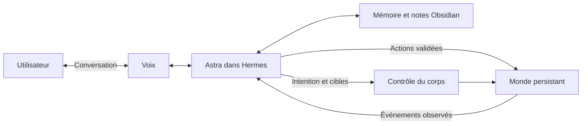

# Promethee

[](https://github.com/Hokimisu/Promethee/actions/workflows/ci.yml)

Un avatar IA qui parle, agit dans un espace virtuel persistant et reprend ses activités grâce à sa mémoire.

Le projet vise une pièce que l'avatar peut aménager avec ses objets : une chaise, une pancarte, un doudou, puis un lit et une TV. Un agent choisit ses actions et ses intentions de mouvement ; le monde lui renvoie ce qui s'est effectivement passé. Les expériences retenues deviennent consultables dans Obsidian.

**État actuel : socle local exécutable.** La démonstration est un scénario déterministe dans un monde logique. L'avatar 3D, les modèles IA, la voix, Hermes et la génération de mouvements ne sont pas encore intégrés. Aucun appel réseau, aucune clé API et aucun GPU ne sont nécessaires pour lancer ce socle.

## Essayer

Prérequis : Python 3.12+ et [uv](https://docs.astral.sh/uv/getting-started/installation/).

```sh
git clone https://github.com/Hokimisu/Promethee.git
cd Promethee
uv sync --locked
uv run promethee demo --pause-after 4
uv run promethee world
uv run promethee demo --resume
uv run promethee journal
```

La première commande de démonstration crée trois objets, écrit une pancarte et suspend l'activité. La reprise charge le plan sauvegardé, prend le doudou, rejoint la chaise et s'assied. Relancer la démonstration terminée ne recrée pas les objets.

- `world` affiche l'état persistant, stocké dans `.local/promethee/world.sqlite3`.
- `journal` exporte les actions logiques réussies dans `.local/vault/Promethee/Observed/`. Ouvrir `.local/vault` comme coffre Obsidian pour les consulter.
- Les exports ne réécrivent pas les notes existantes. Les essais rejetés restent dans le registre SQLite et ne deviennent pas des souvenirs de réussite.
- Pour un essai indépendant, choisir un autre dossier : `uv run promethee --data-dir .local/second-demo demo`.

Toutes les commandes fonctionnent sous PowerShell et dans un terminal Linux. Les données personnelles et les exports locaux sont ignorés par Git.

## Ce qui est livré

| Élément | État |
|---|---|
| État du monde et registre d'actions SQLite | Exécutable |
| Actions validées et identifiants de requête idempotents | Exécutable |
| Plan sauvegardé, pause, reprise après redémarrage | Exécutable |
| Catalogue logique chaise / pancarte / doudou / lit / TV | Exécutable ; les usages lit/TV sont à implémenter |
| Journal Markdown lisible dans Obsidian | Export exécutable ; recherche mémoire à connecter |
| Contrôles automatiques et tests de comportement | Fournis |
| Astra dans Hermes, voix GPT-Live | Architecture proposée ; adaptateurs à développer |
| ARDY, modèle 3D, contacts, rendu | Intégration à évaluer et développer |
| Initiative autonome et services externes | Jalons ultérieurs |

## Architecture cible



Le moteur du monde décide si une action a réussi. Un prompt décrit une intention ; les positions, les objets et les contraintes rendent cette intention exécutable. La voix et le corps partagent la même activité en cours. Voir [l'architecture](docs/architecture.md) et les [contrats actuels](docs/contracts.md).

## Développer

```sh
uv run ruff check .
uv run ruff format --check .
uv run pytest -q
uv build
```

Les tests couvrent la reprise dans un nouveau processus, les commandes concurrentes, le rejet des actions impossibles, les transactions interrompues et la préservation des notes modifiées.

```text
src/promethee/    Monde logique, persistance, scénario et export
tests/           Vérifications de comportement
docs/            Vision, architecture, contrats et jalons
.github/         CI et modèles de contributions
```

## Documents

- [Vision et expérience souhaitée](docs/vision.md)
- [Architecture et décisions initiales](docs/architecture.md)
- [Contrats du socle exécutable](docs/contracts.md)
- [Intégrations et références officielles](docs/integrations.md)
- [Mémoire et organisation Obsidian](docs/memory.md)
- [Feuille de route et critères d'acceptation](docs/roadmap.md)
- [Contribuer](CONTRIBUTING.md)
- [Instructions pour les agents de développement](AGENTS.md)

Le code original du dépôt est sous [licence MIT](LICENSE). Les modèles, captures de mouvement, voix et assets externes conservent leurs propres licences ; aucun n'est redistribué ici. Promethee est un projet indépendant, sans affiliation avec OpenAI, NVIDIA ou Nous Research.
