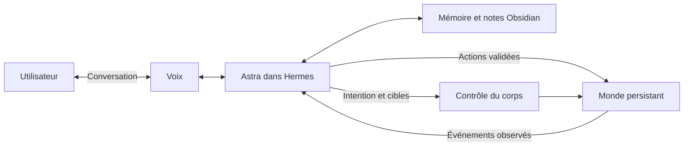

# Promethee

[](https://github.com/Hokimisu/Promethee/actions/workflows/ci.yml)

Un avatar IA doté d'un corps, d'une mémoire et de capacités d'action dans un espace virtuel persistant.

Le projet fournit un espace que l'avatar peut percevoir et modifier, des objets utilisables et une mémoire consultable dans Obsidian. Un agent peut former et réviser ses intentions ; le monde lui renvoie ce qui s'est effectivement passé. Aucun scénario de vie, routine ou préférence d'objet n'est prescrit.

**État actuel : socle local et premier pilote cinématique ARDY.** La démonstration reste une fixture déterministe dans un monde logique. Le rendu optionnel permet un pilotage manuel du squelette avec progression et arrêt confirmés. La [qualification T07](docs/motion-validation.md) reste en cours : plusieurs déplacements échouent aux contrôles de contact. Via le [pont MCP](docs/hermes-setup.md), Astra a conversé, retrouvé l'historique après redémarrage, demandé une posture exécutée par ARDY et rapporté une annulation confirmée. La voix reste à qualifier. Aucun appel réseau, aucune clé API et aucun GPU ne sont nécessaires pour lancer le socle logique.

## Essayer

Prérequis : Python 3.12+ et [uv](https://docs.astral.sh/uv/getting-started/installation/).

```sh
git clone https://github.com/Hokimisu/Promethee.git
cd Promethee
uv sync --locked
uv run promethee demo --pause-after 4
uv run promethee world
uv run promethee demo --resume
uv run promethee journal
```

La première commande de démonstration crée trois objets, écrit une pancarte et suspend l'activité. La reprise charge le plan sauvegardé, prend le doudou, rejoint la chaise et s'assied. Relancer la démonstration terminée ne recrée pas les objets.

Cette séquence est une fixture de vérification de la persistance. Elle ne définit pas les comportements attendus du futur avatar. Ses actions et ses exports restent des données de test, à exclure des prompts, de la mémoire initiale et des objectifs d'entraînement de l'agent.

- `world` affiche l'état persistant, stocké dans `.local/promethee/world.sqlite3`.
- `journal` exporte les actions logiques réussies dans `.local/vault/Promethee/Observed/`. Ouvrir `.local/vault` comme coffre Obsidian pour les consulter.
- Les exports ne réécrivent pas les notes existantes. Les essais rejetés restent dans le registre SQLite et ne deviennent pas des souvenirs de réussite.
- Pour un essai indépendant, choisir un autre dossier : `uv run promethee --data-dir .local/second-demo demo`.

Toutes les commandes fonctionnent sous PowerShell et dans un terminal Linux. Les données personnelles et les exports locaux sont ignorés par Git.

Pour piloter librement ce monde logique, consulter `uv run promethee catalog`, puis écrire une action `{ "kind": "move", "args": { "position": [2, -3] } }` dans un fichier UTF-8 `action.json` :

```sh
uv run promethee --data-dir .local/manual act --request-id mouvement-1 --file action.json
uv run promethee --data-dir .local/manual world
```

Cette commande réalise une transition instantanée, sans activité préécrite ni mouvement 3D. Voir les [contrats et codes de sortie](docs/contracts.md).

## Ce qui est livré

| Élément | État |
|---|---|
| État du monde et registre d'actions SQLite | Exécutable |
| Actions validées et identifiants de requête idempotents | Exécutable |
| Plan sauvegardé, pause, reprise après redémarrage | Exécutable |
| Origine des données, révisions et migration sauvegardée | Exécutable ; séparation fixture / session / legacy |
| Suivi asynchrone, annulation et récupération du corps | API CPU et pilote ARDY ; arrêt et reprise vérifiés |
| Catalogue logique chaise / pancarte / doudou / lit / TV | Exécutable ; les usages lit/TV sont à implémenter |
| Mémoire Markdown lisible dans Obsidian | Sources, recherche et corrections ; six appels Astra réels dans deux mondes de qualification |
| Contrôles automatiques et tests de comportement | Fournis |
| Pont d'outils Hermes | Astra réel : conversation, historique, posture exécutée et annulation retrouvée après interruption |
| Voix de diagnostic | Chaîne transcription/Hermes/synthèse testée avec fournisseurs simulés ; microphone et voix réels non qualifiés |
| ARDY Core et rendu Viser | Pilotage cinématique manuel ; qualification des déplacements incomplète |
| Apparence anime en VRM | Lecture et [session en direct](docs/live-avatar.md) ; prise/dépôt cinématiques, arrêt et restauration ; contacts géométriques des poses préparées mesurés, équilibre physique non validé |
| Initiative à budget explicite | Essais Astra réels : pause persistante, budgets, historiques variés et capacités retirées ; dépendance vocale encore ouverte |
| Services externes | Extensions ultérieures selon besoin observé |

## Architecture cible

Le [guide de rendu](docs/rendering.md) donne l'installation optionnelle et les commandes pour consulter un monde existant ou lire un enregistrement moteur. La [session VRM](docs/live-avatar.md) permet aussi de manipuler un doudou ou une balle géométrique avec le contrôleur cinématique.



Le moteur du monde décide si une action a réussi. Un prompt décrit une intention ; les positions, les objets et les contraintes rendent cette intention exécutable. La voix et le corps partagent le même contexte, avec ou sans activité en cours. Voir [l'architecture](docs/architecture.md) et les [contrats actuels](docs/contracts.md).

## Développer

Commencer par le [plan d'implémentation](docs/implementation-plan.md) : T00 vérifie le socle, puis T01 ajoute un pilotage manuel sans scénario. Chaque ticket indique son périmètre, ses dépendances et ses critères de validation.

```sh
uv run ruff check .
uv run ruff format --check .
uv run pytest -q
uv build
```

Les tests couvrent la reprise dans un nouveau processus, les commandes concurrentes, le rejet des actions impossibles, les transactions interrompues et la préservation des notes modifiées. Le suivi du corps distingue acceptation, progression et résultat confirmé ; les essais de panne utilisent un contrôleur explicitement factice, sans valider de mouvement 3D.

```text
src/promethee/    Monde logique, persistance, scénario et export
tests/           Vérifications de comportement
docs/            Vision, architecture, contrats et jalons
.github/         CI et modèles de contributions
```

## Documents

- [Vision et expérience souhaitée](docs/vision.md)
- [Architecture et décisions initiales](docs/architecture.md)
- [Contrats du socle exécutable](docs/contracts.md)
- [Intégrations et références officielles](docs/integrations.md)
- [Mémoire et organisation Obsidian](docs/memory.md)
- [Feuille de route et critères d'acceptation](docs/roadmap.md)
- [Plan d'implémentation pour le développeur](docs/implementation-plan.md)
- [Avancement vérifié des tickets](docs/progress.md)
- [Recherche de solutions pour les mouvements, le visage, la voix et la caméra](docs/research/humanlike-solutions-2026-09-15.md)
- [Pont Hermes et accès au modèle](docs/hermes-setup.md)
- [Voix de diagnostic et interruptions](docs/voice.md)
- [Initiative, budget et pause](docs/initiative.md)
- [Provenance de l'avatar VRM](docs/assets/pixiv-vrm-sample.md)
- [Lecture animée de l'avatar](docs/avatar-rendering.md)
- [Contribuer](CONTRIBUTING.md)
- [Instructions pour les agents de développement](AGENTS.md)

Le code original du dépôt est sous [licence MIT](LICENSE). Les modèles, captures de mouvement, voix et assets externes conservent leurs propres licences ; aucun n'est redistribué ici. Promethee est un projet indépendant, sans affiliation avec OpenAI, NVIDIA ou Nous Research.
